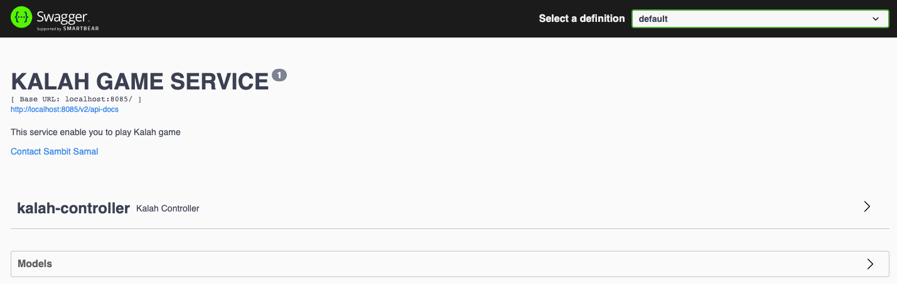
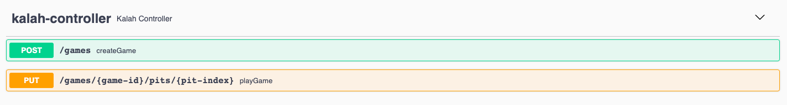
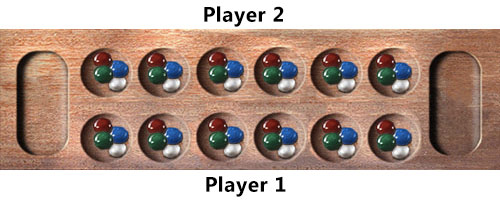

# Kalah Game Service

## Description:

This service will allow you to play a game called Kalah also called Kalaha, is a copy of the ancient game mancala.

### Board SetUp :

Each of the two players has his six pits in front of him. To the right of the six pits, each player has a larger pit. At
the start of the game, there are six stones in each of the six round pits.

### Game Rules :

- #### Game Play :

The player who begins with the first move picks up all the stones in any of his own six pits, and sows the stones on to
the right, one in each of the following pits, including his own big pit. No stones are put in the opponents' big pit. If
the player's last stone lands in his own big pit, he gets another turn. This can be repeated several times before it's
the other player's turn.

- #### Capturing Stones :

During the game the pits are emptied on both sides. Always when the last stone lands in an own empty pit, the player
captures his own stone and all stones in the opposite pit (the other player’s pit)
and puts them in his own (big or little?) pit.

- #### The Game Ends :

The game is over as soon as one of the sides runs out of stones. The player who still has stones in his pits keeps them
and puts them in his big pit. The winner of the game is the player who has the most stones in his big pit.

## Pre-requisite

- Java 17
- Maven
- Git bash (Or any IDE from where you can connect to git)

## Steps to run the application

- Checkout the code / Download from git repo(https://github.com/sambit1007599/kalah-game-service.git)
- checkout : open git bash and run command `git clone https://github.com/sambit1007599/kalah-game-service.git`
- open command prompt(cmd)
- go inside the project folder
- run command `mvn clean install`
- once its successfully build run command `mvn spring-boot: run`

Now application is up and running

## How to play this game

- Open the URL in your browser : http://localhost:7075/swagger-ui/index.html
- You will see a swagger page with all the defined specs of the service. There will be 1 POST method you can see.
- 

### 1. POST : /games

#### Description:

- This endpoint will allow you to create a game and will provide you a game id.
- Click on POST -> Try it out -> Execute
- You have to use this game ID to play the game.

### 2. PUT : /games/{gameId}/pits/{pitIndex}

#### Description:

- This endpoint will allow both the players to play the game. Here you have to give the gameID you created in the
  previous endpoint. And you have to select the PitIndex where you want to pick the stones and play.
- Click on PUT -> Try it out -> provide {gameId} & {pitIndex} -> Execute
- You will get the response with the current status of pit with number of stones.

### Actual Game For Reference

### As Per this Service:

Each block is a pit, and containing 6 stones each.

- Player 1 : pits(1,2,3,4,5,6) **_Big Pit_**: 7
- Player 2 : pits(8,9,10,11,12,13) **_Big Pit_**: 14

- As per game rule and player turn you have to select the pit number.
- If you select wrong pit or wrong player turn you will get customized error message.

# !!! Enjoy The Game !!!